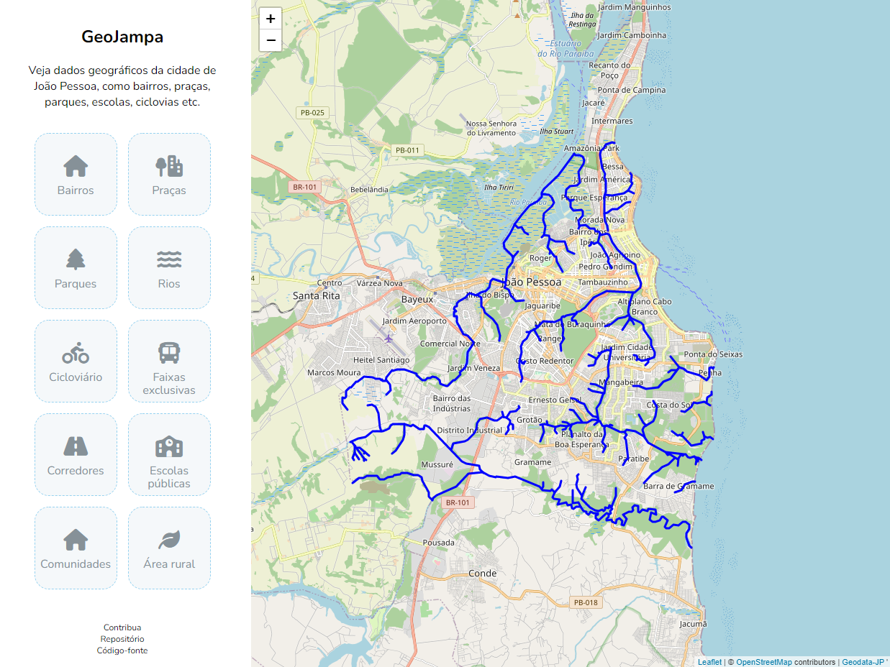

# geojampa

Uma aplicação server-side com dados geográficos da cidade de João Pessoa.



Projeto feito apenas para estudo.

## Tecnologias

- React
- Leaflet
- Bootstrap

## Instalação

Para instalar as dependências, execute:
```
yarn
```

Para iniciar a aplicação, execute:
```
yarn dev
```

## Layers

- Bairros
- Ciclovias
- Corredores
- Faixas exclusivas de ônibus
- Parques
- Praças
- Rios
